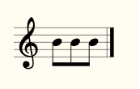
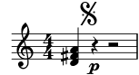
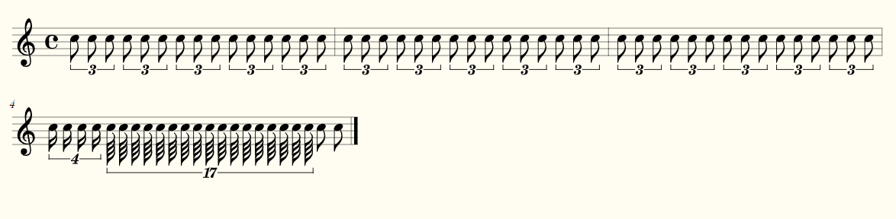
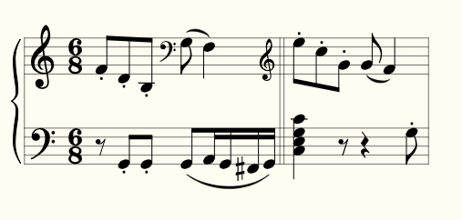
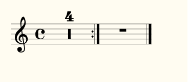
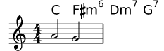

# Tests

## 01a-Pitches-Pitches.png

All pitches from G to c”” in ascending steps; First without accidentals, then with a sharp and then with a flat accidental. Double alterations and cautionary accidentals are tested at the end. 

### Unofficial lilypond MusicXML render

### Verovio Humdrum Viewer render
,

## 01b-Pitches-Intervals.png

All pitch intervals in ascending jump size. 

### Unofficial lilypond MusicXML render

### Verovio Humdrum Viewer render
,

## 01c-Pitches-NoVoiceElement.png

The <voice> element of notes is optional in MusicXML (although Dolet always writes it out). Here, there is one note with lyrics, but without a voice assigned. It should still be correctly converted. 

### Unofficial lilypond MusicXML render

### Verovio Humdrum Viewer render
,

## 01d-Pitches-Microtones.png

Some microtones: c flat-and-a-half, d half-flat, e half-sharp, f sharp-and-a half. Once in the lower and once in the upper region of the staff. 

### Unofficial lilypond MusicXML render

### Verovio Humdrum Viewer render
,

## 01e-Pitches-ParenthesizedAccidentals.png

Accidentals can be cautionary or editorial. Each measure has a normal accidental, an editorial, a cautionary and an editioal and cautionary accidental. 

### Unofficial lilypond MusicXML render

### Verovio Humdrum Viewer render
,

## 01f-Pitches-ParenthesizedMicrotoneAccidentals.png

Microtone accidentals can be cautionary or editorial. Each measure has a normal accidental, an editorial, a cautionary and an editioal and cautionary accidental. 

### Unofficial lilypond MusicXML render

### Verovio Humdrum Viewer render
,

## 02a-Rests-Durations.png

All different rest lengths: A two-bar multi-measure rest, a whole rest, a half, etc. until a 128th-rest; Then the same with dotted durations. 

### Unofficial lilypond MusicXML render

### Verovio Humdrum Viewer render
,

## 02b-Rests-PitchedRests.png

Rests can have explicit pitches, where they are displayed. The first rest uses no explicit position and should use the default position, all others are explicitly positioned somewhere else. 

### Unofficial lilypond MusicXML render

### Verovio Humdrum Viewer render
,

## 02c-Rests-MultiMeasureRests.png

Four multi-measure rests: 3 measures, 15 measures, 1 measure, and 12 measures. 

### Unofficial lilypond MusicXML render

### Verovio Humdrum Viewer render
,

## 02d-Rests-Multimeasure-TimeSignatures.png

Multi-Measure rests should always be converted into durations that are a multiple of the time signature. 

### Unofficial lilypond MusicXML render

### Verovio Humdrum Viewer render
,

## 02e-Rests-NoType.png

In some cases, a rest might not have its type attribute set (this happens, for example, with voices in Finale, where you don’t manually insert a rest). 

### Unofficial lilypond MusicXML render

### Verovio Humdrum Viewer render
,

## 03a-Rhythm-Durations.png

All note durations, from long, brevis, whole until 128th; First with their plain values, then dotted and finally doubly-dotted. 

### Unofficial lilypond MusicXML render

### Verovio Humdrum Viewer render
,

## 03b-Rhythm-Backup.png

Two voices with a backup, that does not jump to the beginning for the measure for voice 2, but somewhere in the middle. Voice 2 thus won’t have any notes or rests for the first beat of the measures. 

### Unofficial lilypond MusicXML render

### Verovio Humdrum Viewer render
,

## 03c-Rhythm-DivisionChange.png

Although uncommon, the divisions of a quarter note can change somewhere in the middle of a MusicXML file. Here, the first half measure uses a division of 1, which then changes to 8 in the middle of the first measure and to 38 in the middle of the second measure. 

### Unofficial lilypond MusicXML render

### Verovio Humdrum Viewer render
,

## 03d-Rhythm-DottedDurations-Factors.png

Several durations can be written with dots. For multimeasure rests, we can also have durations that cannot be expressed with dotted notes (like 5/8). 

### Unofficial lilypond MusicXML render

### Verovio Humdrum Viewer render
,

## 11a-TimeSignatures.png

Various time signatures: 2/2 (alla breve), 4/4 (C), 2/2, 3/2, 2/4, 3/4, 4/4, 5/4, 3/8, 6/8, 12/8 

### Unofficial lilypond MusicXML render

### Verovio Humdrum Viewer render
,

## 11b-TimeSignatures-NoTime.png

A score without a time signature (but with a key and clefs) 

### Unofficial lilypond MusicXML render

### Verovio Humdrum Viewer render
,

## 11c-TimeSignatures-CompoundSimple.png

Compound time signatures with same denominator: (3+2)/8 and (5+3+1)/4. 

### Unofficial lilypond MusicXML render

### Verovio Humdrum Viewer render
,

## 11d-TimeSignatures-CompoundMultiple.png

Compound time signatures with separate fractions displayed: 3/8+2/8+3/4 and 5/2+1/8. 

### Unofficial lilypond MusicXML render

### Verovio Humdrum Viewer render
,

## 11e-TimeSignatures-CompoundMixed.png

Compound time signatures of mixed type: (3+2)/8+3/4. 

### Unofficial lilypond MusicXML render

### Verovio Humdrum Viewer render
,

## 11f-TimeSignatures-SymbolMeaning.png

A time signature of 3/8 with the symbol="cut" attribute and two symbol="single-number" attributes with compound time signatures. Shall the symbol be ignored in this case? 

### Unofficial lilypond MusicXML render

### Verovio Humdrum Viewer render
,

## 11g-TimeSignatures-SingleNumber.png

Time signature displayed as a single number. 

### Unofficial lilypond MusicXML render

### Verovio Humdrum Viewer render
,

## 11h-TimeSignatures-SenzaMisura.png

Senza-misura time signature 

### Unofficial lilypond MusicXML render

### Verovio Humdrum Viewer render
,

## 12a-Clefs.png

Various clefs: G, C, F, percussion, TAB and none; some are also possible with transposition and on other staff lines than their default (e.g. soprano/alto/tenor/baritone C clefs); Each measure shows a different clef (measure 17 has the "none" clef), only measure 18 has the same treble clef as measure 1. 

### Unofficial lilypond MusicXML render

### Verovio Humdrum Viewer render
,

## 12b-Clefs-NoKeyOrClef.png

A score without any key or clef defined. The default (4/4 in treble clef) should be used. 

### Unofficial lilypond MusicXML render

### Verovio Humdrum Viewer render
,

## 13a-KeySignatures.png

Various key signature: from 11 flats to 11 sharps (each one first one measure in major, then one measure in minor) 

### Unofficial lilypond MusicXML render

### Verovio Humdrum Viewer render
,

## 13b-KeySignatures-ChurchModes.png

All different modes: major, minor, ionian, dorian, phrygian, lydian, mixolydian, aeolian, and locrian; All modes are given with 2 sharps. 

### Unofficial lilypond MusicXML render

### Verovio Humdrum Viewer render
,

## 13c-KeySignatures-NonTraditional.png

Non-traditional key signatures, where each alteration is separately given. Here we have (f sharp, a flat, b flat) and (c flatflat, g sharp sharp, d flat, b sharp, f natural), where in the second case an explicit octave is given for each alteration. 

### Unofficial lilypond MusicXML render

### Verovio Humdrum Viewer render
,

## 13d-KeySignatures-Microtones.png

Non-traditional key signatures with microtone alterations: (g flat-and-a-half, a flat, b half-flat, c natural, d half-sharp, e sharp, f sharp-and-a-half). 

### Unofficial lilypond MusicXML render

### Verovio Humdrum Viewer render
,

## 14a-StaffDetails-LineChanges.png

The number of staff lines can be modified by using the staff-lines child of the staff-details attribute. This can happen globally (the first staff has one line globally) or during the part at the beginning of a measure and even inside a measure (the second part has 5 lines initially, 4 at the beginning of the second measure, and 3 starting in the middle of the third measure). 

### Unofficial lilypond MusicXML render

### Verovio Humdrum Viewer render
,

## 21a-Chord-Basic.png

One simple chord consisting of two notes. 

### Unofficial lilypond MusicXML render

### Verovio Humdrum Viewer render
,

## 21b-Chords-TwoNotes.png

Some subsequent (identical) two-note chords. 

### Unofficial lilypond MusicXML render

### Verovio Humdrum Viewer render
,

## 21c-Chords-ThreeNotesDuration.png

Some three-note chords, with various durations. 

### Unofficial lilypond MusicXML render

### Verovio Humdrum Viewer render
,

## 21d-Chords-SchubertStabatMater.png

Chords in the second measure, after several ornaments in the first measure and a p at the beginning of the second measure. 

### Unofficial lilypond MusicXML render

### Verovio Humdrum Viewer render
,

## 21e-Chords-PickupMeasures.png

Check for proper chord detection after a pickup measure (i.e. the first beat of the measure is not aligned with multiples of the time signature)! 

### Unofficial lilypond MusicXML render

### Verovio Humdrum Viewer render
,

## 21f-Chord-ElementInBetween.png

Between the individual notes of a chord there can be direction or harmony elements, which should be properly assigned to the chord (or the position of the chord). 

### Unofficial lilypond MusicXML render

### Verovio Humdrum Viewer render
,

## 22a-Noteheads.png

Different note styles, using the <notehead> element. First, each note head style is printed with four quarter notes, two with filled heads, two with unfilled heads, where first the stem is up and then the stem is down. After that, each note head style is printed with a half note (should have an unfilled head by default). Finally, the Aiken note head styles are tested, once with stem up and once with stem down. 

### Unofficial lilypond MusicXML render

### Verovio Humdrum Viewer render
,

## 22b-Staff-Notestyles.png

Staff-connected note styles: slash notation, hidden notes (with and without hidden staff lines) 

### Unofficial lilypond MusicXML render

### Verovio Humdrum Viewer render
,

## 22c-Noteheads-Chords.png

Different note styles for individual notes inside a chord, using the <notehead> element. 

### Unofficial lilypond MusicXML render

### Verovio Humdrum Viewer render
,

## 22d-Parenthesized-Noteheads.png

Parenthesized note heads. First, a single parenthesized note is tested, once with a normal and then with a non-standard notehead, then two chords with some/all parenthesized noteheads and finally a parenthesized rest. 

### Unofficial lilypond MusicXML render

### Verovio Humdrum Viewer render
,

## 23a-Tuplets.png

Some tuplets (3:2, 3:2, 3:2, 4:2, 4:1, 7:3, 6:2) with the default tuplet bracket displaying the number of actual notes played. The second tuplet does not have a number attribute set. 

### Unofficial lilypond MusicXML render

### Verovio Humdrum Viewer render
,

## 23b-Tuplets-Styles.png

Different tuplet styles: default, none, x:y, x:y-note; Each with bracket, slur and none. Finally, non-standard 4:3 and 17:2 tuplets are given. 

### Unofficial lilypond MusicXML render

### Verovio Humdrum Viewer render
,

## 23c-Tuplet-Display-NonStandard.png

Displaying tuplet note types, that might not coincide with the displayed note. The first two tuplets take the type from the note, the second two from the <time-modification> element, the remaining pair of tuplets from the <tuplet> notation element. The tuplets in measure 3 specify both a number of notes and a type inside the <tuplet-actual> and <tuplet-normal> elements, the ones in measure 4 specify only a note type (but no number), and the ones in measure 5 specify only a number of tuplet-notes (but no type, which is deduced from the note’s type). The first tuplet of measures 3-5 uses ’display-type="actual"’, the second one ’display-type="both"’. FIXME: The tuplet-normal should coincide with the real notes! 

### Unofficial lilypond MusicXML render

### Verovio Humdrum Viewer render
,

## 23d-Tuplets-Nested.png

Tuplets can be nested. Here there is a 5:2 tuplet inside a 3:2 tuple (all consisting of written eighth notes). 

### Unofficial lilypond MusicXML render

### Verovio Humdrum Viewer render
,

## 23e-Tuplets-Tremolo.png

Tremolo tuplets are tuplets on single notes with a tremolo ornament. The application shall correctly import these notes with 2/3 or their time... 

### Unofficial lilypond MusicXML render

### Verovio Humdrum Viewer render
,

## 23f-Tuplets-DurationButNoBracket.png

Some "triplets" on the end of the first and in the second staff, using only <time-modification>, but not explicit tuplet bracket. Thus, the duration of the notes in the second staff should be scaled properly in comparison to staff 1, but no visual indication about the tuplets is given. 

### Unofficial lilypond MusicXML render

### Verovio Humdrum Viewer render
,

## 24a-GraceNotes.png

Different kinds of grace notes: acciaccatura, appoggiatura; beamed grace notes; grace notes with accidentals; different durations of the grace notes. 

### Unofficial lilypond MusicXML render

### Verovio Humdrum Viewer render
,

## 24b-ChordAsGraceNote.png

Chords as grace notes. 

### Unofficial lilypond MusicXML render

### Verovio Humdrum Viewer render
,

## 24c-GraceNote-MeasureEnd.png

A grace note that appears at the measure end (without any steal-from-* attribute set). Some applications need to convert this into an after-grace. 

### Unofficial lilypond MusicXML render

### Verovio Humdrum Viewer render
,

## 24d-AfterGrace.png

Some grace notes and after-graces (indicated by steal-time-previous and steal-time-following). 

### Unofficial lilypond MusicXML render

### Verovio Humdrum Viewer render
,

## 24e-GraceNote-StaffChange.png

A grace note on a different staff than the actual note. 

### Unofficial lilypond MusicXML render

### Verovio Humdrum Viewer render
,

## 24f-GraceNote-Slur.png

A grace note with a slur to the actual note. This can be interpreted as acciaccatura or appoggiatura, depending on the existence of a slash. 

### Unofficial lilypond MusicXML render

### Verovio Humdrum Viewer render
,

## 31a-Directions.png

All <direction> elements defined in MusicXML. The lyrics for each note describes the direction element assigned to that note. 

### Unofficial lilypond MusicXML render

### Verovio Humdrum Viewer render
,

## 31c-MetronomeMarks.png

Tempo Markings: note=bpm, text (note=bpm), note=note, (note=note), (note=bpm) 

### Unofficial lilypond MusicXML render

### Verovio Humdrum Viewer render
,

## 32a-Notations.png

All <notation> elements defined in MusicXML. The lyrics show the notation assigned to each note. 

### Unofficial lilypond MusicXML render

### Verovio Humdrum Viewer render
,

## 32b-Articulations-Texts.png

Text markup: different font sizes, weights and colors. 

### Unofficial lilypond MusicXML render

### Verovio Humdrum Viewer render
,

## 32c-MultipleNotationChildren.png

It should not make any difference whether two articulations are given inside two different notation elements, inside two different articulations children of the same notation element or inside the same articulations element. Thus, all three notes should have a staccato and an accent. 

### Unofficial lilypond MusicXML render

### Verovio Humdrum Viewer render
,

## 32d-Arpeggio.png

Different Arpeggio directions (normal, up, down, non-arpeggiate) 

### Unofficial lilypond MusicXML render

### Verovio Humdrum Viewer render
,

## 33a-Spanners.png

Several spanners defined in MusicXML: tuplet, slur (solid, dashed), tie,  wedge (cresc, dim), tr + wavy-line, single-note trill spanner, octave-shift (8va,15mb), bracket (solid down/down, dashed down/down, solid none/down, dashed none/up, solid none/none), dashes, glissando (wavy), bend-alter, slide (solid), grouping, two-note tremolo, hammer-on, pull-off, pedal (down, change, up). 

### Unofficial lilypond MusicXML render

### Verovio Humdrum Viewer render
,

## 33b-Spanners-Tie.png

Two simple tied whole notes 

### Unofficial lilypond MusicXML render

### Verovio Humdrum Viewer render
,

## 33c-Spanners-Slurs.png

A note can be the end of one slur and the start of a new slur. Also, in MusicXML, nested slurs are possible like in the second measure where one slur goes over all four notes, and another slur goes from the second to the third note. 

### Unofficial lilypond MusicXML render

### Verovio Humdrum Viewer render
,

## 33d-Spanners-OctaveShifts.png

All types of octave shifts (15ma, 15mb, 8va, 8vb) 

### Unofficial lilypond MusicXML render

### Verovio Humdrum Viewer render
,

## 33e-Spanners-OctaveShifts-InvalidSize.png

Invalid octave-shifts: 27 down, 11 up. 

### Unofficial lilypond MusicXML render

### Verovio Humdrum Viewer render
,

## 33f-Trill-EndingOnGraceNote.png

A trill spanner that spans a grace note and ends on an after-grace note at the end of the measure. 

### Unofficial lilypond MusicXML render

### Verovio Humdrum Viewer render
,

## 33g-Slur-ChordedNotes.png

Slurs on chorded notes: Only the first note of the chord should get the slur notation. Some applications print out the slur for all notes – these should be ignored. 

### Unofficial lilypond MusicXML render

### Verovio Humdrum Viewer render
,

## 33h-Spanners-Glissando.png

All different types of glissando defined in MusicXML 

### Unofficial lilypond MusicXML render

### Verovio Humdrum Viewer render
,

## 33i-Ties-NotEnded.png

Several ties that have their end tag missing. 

### Unofficial lilypond MusicXML render

### Verovio Humdrum Viewer render
,

## 41a-MultiParts-Partorder.png

A piece with four parts (P0, P1, P2, P3; different from what Finale creates!). Are they converted in the correct order? 

### Unofficial lilypond MusicXML render

### Verovio Humdrum Viewer render
,

## 41b-MultiParts-MoreThan10.png

A piece with 20 parts to check whether an application supports that many parts and whether they are correctly sorted. 

### Unofficial lilypond MusicXML render

### Verovio Humdrum Viewer render
,

## 41c-StaffGroups.png

A huge orchestra score with 28 parts and different kinds of nested bracketed groups. Each part/group is assigned a name and an abbreviation to be shown before the staff. Also, most of the groups show unbroken barlines, while the barlines are broken between the groups. 

### Unofficial lilypond MusicXML render

### Verovio Humdrum Viewer render
,

## 41d-StaffGroups-Nested.png

Two properly nested part groups: One group  (with a square bracket) goes from staff 2 to 4) and another group (with a curly bracket) goes from staff 3 to 4. 

### Unofficial lilypond MusicXML render

### Verovio Humdrum Viewer render
,

## 41e-StaffGroups-InstrumentNames-Linebroken.png

Part names and abbreviations can contain line breaks. 

### Unofficial lilypond MusicXML render

### Verovio Humdrum Viewer render
,

## 41f-StaffGroups-Overlapping.png

MusicXML allows for overlapping part-groups, while many applications do not allow overlapping groups, but require them to be properly nested. In this case, one group (with a square bracket) goes from staff 2 to 4) and another group (with a curly bracket) goes from staff 3 to 5. 

### Unofficial lilypond MusicXML render

### Verovio Humdrum Viewer render
,

## 41g-PartNoId.png

A part with no id attribute. Since this piece has only one part, it is clear which part is described by the one part element. 

### Unofficial lilypond MusicXML render

### Verovio Humdrum Viewer render
,

## 41h-TooManyParts.png

This piece has more part elements than the part-list section gives. One can either convert all the parts present, but not listed in the part-list, or simply not import / ignore them. 

### Unofficial lilypond MusicXML render

### Verovio Humdrum Viewer render
,

## 41i-PartNameDisplay-Override.png

The first staff uses only part-name, while the second one (same part-name) overrides it with a custom text. Similar for the part-abbreviation used in subsequent staves. 

### Unofficial lilypond MusicXML render

### Verovio Humdrum Viewer render
,

## 42a-MultiVoice-TwoVoicesOnStaff-Lyrics.png

Two voices share one staff. Each voice is assigned some lyrics. 

### Unofficial lilypond MusicXML render

### Verovio Humdrum Viewer render
,

## 42b-MultiVoice-MidMeasureClefChange.png

A multi-voice / multi-staff part with a clef change in the middle of a measure and a <backward> for voice 2 jumping back beyond that clef change. 

### Unofficial lilypond MusicXML render

### Verovio Humdrum Viewer render
,

## 43a-PianoStaff.png

A simple piano staff 

### Unofficial lilypond MusicXML render

### Verovio Humdrum Viewer render
,

## 43b-MultiStaff-DifferentKeys.png

A piano staff with different keys and clefs for each of its staves. The keys and clefs for both staves are given at the very beginning of the measure. 

### Unofficial lilypond MusicXML render

### Verovio Humdrum Viewer render
,

## 43c-MultiStaff-DifferentKeysAfterBackup.png

A piano staff with different keys and clefs for each of its staves. The key and clef for the second staff is given only after a backward, just before the first note of the second staff is given, but after the whole measure for staff 1 has been given. 

### Unofficial lilypond MusicXML render

### Verovio Humdrum Viewer render
,

## 43d-MultiStaff-StaffChange.png

Staff changes in a piano staff. The voice from the second staff has some notes/chords on the first staff. The final two chords have some notes on the first, some on the second staff. 

### Unofficial lilypond MusicXML render

### Verovio Humdrum Viewer render
,

## 43e-Multistaff-ClefDynamics.png

A piano staff with dynamics and clef changes, where each element (ffff, wedge and clef changes) applies only to one voice or one staff, respectively. 

### Unofficial lilypond MusicXML render

### Verovio Humdrum Viewer render
,

## 45a-SimpleRepeat.png

A simple, repeated measure (repeated 5 times) 

### Unofficial lilypond MusicXML render

### Verovio Humdrum Viewer render
,

## 45b-RepeatWithAlternatives.png

A simple repeat with two alternative endings (volta brackets). 

### Unofficial lilypond MusicXML render

### Verovio Humdrum Viewer render
,

## 45c-RepeatMultipleTimes.png

Repeats can also be nested. 

### Unofficial lilypond MusicXML render

### Verovio Humdrum Viewer render
,

## 45d-Repeats-Nested-Alternatives.png

Nested repeats, each with alternative endings. 

### Unofficial lilypond MusicXML render

### Verovio Humdrum Viewer render
,

## 45e-Repeats-Nested-Alternatives.png

Some more nested repeats with alternatives. The barline between measure 7 and 8 will probably be messed up! (Should be a repeat on both sides!) 

### Unofficial lilypond MusicXML render

### Verovio Humdrum Viewer render
,

## 45f-Repeats-InvalidEndings.png

Some more nested repeats with alternatives, where the MusicXML file does not make sense in the first place. How well are applications able to cope with improper repeats and alternatives? 

### Unofficial lilypond MusicXML render

### Verovio Humdrum Viewer render
,

## 45g-Repeats-NotEnded.png

A forward-repeating bar line without an ending repeat bar. 

### Unofficial lilypond MusicXML render

### Verovio Humdrum Viewer render
,

## 46a-Barlines.png

Different types of (non-repeat) barlines: default (no setting), regular, dotted, dashed, heavy, light-light, light-heavy, heavy-light, heavy-heavy, tick, short, none. 

### Unofficial lilypond MusicXML render

### Verovio Humdrum Viewer render
,

## 46b-MidmeasureBarline.png

Barlines can appear at mid-measure positions, without using an implicit measure! 

### Unofficial lilypond MusicXML render

### Verovio Humdrum Viewer render
,

## 46c-Midmeasure-Clef.png

A clef change in the middle of a measure, using either an implicit measure or simply placing the attributes in the middle of the measure. 

### Unofficial lilypond MusicXML render

### Verovio Humdrum Viewer render
,

## 46d-PickupMeasure-ImplicitMeasures.png

A 3/8 pickup measure, a measure that is split into one (incomplete, only 2/4) measure and an implicit measure, and an incomplete measure (containg 3/4). 

### Unofficial lilypond MusicXML render

### Verovio Humdrum Viewer render
,

## 46e-PickupMeasure-SecondVoiceStartsLater.png

Voice 2 should start at 2nd beat of first full measure. 

### Unofficial lilypond MusicXML render

### Verovio Humdrum Viewer render
,

## 46f-IncompleteMeasures.png

Measures can contain less notes than the time signature says. Here, the first and third measures contain only two quarters instead of four. 

### Unofficial lilypond MusicXML render

### Verovio Humdrum Viewer render
,

## 46g-PickupMeasure-Chordnames-FiguredBass.png

Pickup measure with chord names and figured bass. 

### Unofficial lilypond MusicXML render

### Verovio Humdrum Viewer render
,

## 51b-Header-Quotes.png

Several header fields and part names can contain quotes ("). This test checks whether they are converted/imported without problems (i.e. whether they are correctly escaped when converting). 

### Unofficial lilypond MusicXML render

### Verovio Humdrum Viewer render
,

## 51c-MultipleRights.png

There can be multiple <rights> tags in the identification element of the score. The conversion shall still work, ideally using both of them. 

### Unofficial lilypond MusicXML render

### Verovio Humdrum Viewer render
,

## 51d-EmptyTitle.png

A piece with an empty (but existing) work-title, but a non-empty movement-title. In this case the movement-title should be chosen, even though the work-title exists. 

### Unofficial lilypond MusicXML render

### Verovio Humdrum Viewer render
,

## 52a-PageLayout.png

Several page layout settings: paper size, margins, system margins and distances, different fonts, etc. 

### Unofficial lilypond MusicXML render

### Verovio Humdrum Viewer render
,

## 52b-Breaks.png

System and page breaks, given in a <print> element 

### Unofficial lilypond MusicXML render

### Verovio Humdrum Viewer render
,

## 61a-Lyrics.png

Some notes with simple lyrics: Syllables, notes without a syllable, syllable spanners. 

### Unofficial lilypond MusicXML render

### Verovio Humdrum Viewer render
,

## 61b-MultipleLyrics.png

Multiple (simple) lyrics. The order of the exported stanzas is relevant (identified by the number attribute in this test case) 

### Unofficial lilypond MusicXML render

### Verovio Humdrum Viewer render
,

## 61c-Lyrics-Pianostaff.png

Lyrics assigned to the voices of a piano staff containing two simple staves. Each staff is assigned exactly one lyrics line. 

### Unofficial lilypond MusicXML render

### Verovio Humdrum Viewer render
,

## 61d-Lyrics-Melisma.png

How to treat lyrics and slurred notes. Normally, a slurred group of notes is assigned only one lyrics syllable. 

### Unofficial lilypond MusicXML render

### Verovio Humdrum Viewer render
,

## 61e-Lyrics-Chords.png

Assigning lyrics to chorded notes. 

### Unofficial lilypond MusicXML render

### Verovio Humdrum Viewer render
,

## 61f-Lyrics-GracedNotes.png

Grace notes shall not mess up the lyrics, and they shall not be assigned a syllable. 

### Unofficial lilypond MusicXML render

### Verovio Humdrum Viewer render
,

## 61g-Lyrics-NameNumber.png

A lyrics syllable can have both a number and a name attribute. The question is: What should be used to put syllables of the same voice together. This example uses different number/name combinations to check how different applications handle this unspecified case (The advice on the MusicXML mailing list was "there is no correct way, each application can do what it thinks is best"). 

### Unofficial lilypond MusicXML render

### Verovio Humdrum Viewer render
,

## 61h-Lyrics-BeamsMelismata.png

Beaming or slurs can indicate melismata for lyrics. Also make sure that notes without an explicit syllable are treated as if they were part of a melisma. 

### Unofficial lilypond MusicXML render

### Verovio Humdrum Viewer render
,

## 61i-Lyrics-Chords.png

Each note of a chord can have some lyrics attached. In this case, each note of the chord has lyrics of the form "Lyrics [123]" attached, where each lyrics has a different number attribute to distinguish them. These syllables should be imported into three different stanzas and the timing should be correct. 

### Unofficial lilypond MusicXML render

### Verovio Humdrum Viewer render
,

## 61j-Lyrics-Elisions.png

Multiple lyrics syllables assigned to a single note are implemented either using a space in the lyrics or by using the <elision> lyrics element. This testcase checks both of them. First, a note with on syllable is given, then a note with two syllables separated by a spcae and finally a note with two and one with three syllables implemented using <elision> is given. 

### Unofficial lilypond MusicXML render

### Verovio Humdrum Viewer render
,

## 61k-Lyrics-SpannersExtenders.png

Lyrics spanners: continued syllables and extenders, possibly spanning multiple notes. The intermediate notes do not have any <lyric> element. 

### Unofficial lilypond MusicXML render

### Verovio Humdrum Viewer render
,

## 71a-Chordnames.png

A normal staff with several (complex) chord names displayed. 

### Unofficial lilypond MusicXML render

### Verovio Humdrum Viewer render
,

## 71c-ChordsFrets.png

A staff with chord names and some fretboards shown. The fretboards can have an arbitrary number of frets/strings, can start at an arbitrary fret and can even contain fingering information. 

### Unofficial lilypond MusicXML render

### Verovio Humdrum Viewer render
,

## 71d-ChordsFrets-Multistaff.png

Chords and fretboards assigned to the voices in a multi-voice, multi-staff part. There should be fret diagrams above each of the two staves. 

### Unofficial lilypond MusicXML render

### Verovio Humdrum Viewer render
,

## 71e-TabStaves.png

Some tablature staves, with explicit fingering information and different string tunings given in the MusicXML file. 

### Unofficial lilypond MusicXML render

### Verovio Humdrum Viewer render
,

## 71f-AllChordTypes.png

All chord types defined in MusicXML. The staff will only contain one c’ note (NO chord) for all of them, but the chord names should be properly printed. 

### Unofficial lilypond MusicXML render

### Verovio Humdrum Viewer render
,

## 71g-MultipleChordnames.png

There can be multiple subsequent harmony elements, indicating a harmony change during a note 

### Unofficial lilypond MusicXML render

### Verovio Humdrum Viewer render
,

## 72a-TransposingInstruments.png

Transposing instruments: Trumpet in Bb, Horn in Eb, Piano; All of them show the C major scale (the trumpet with 2 sharp, the horn with 3 sharp). 

### Unofficial lilypond MusicXML render

### Verovio Humdrum Viewer render
,

## 72b-TransposingInstruments-Full.png

Various transposition. Each part plays a c”, just displayed in different display pitches. The second-to-last staff uses a transposition where the displayed c’ is an actual f”’ concert pitch. The final staff is an untransposed instrument. 

### Unofficial lilypond MusicXML render

### Verovio Humdrum Viewer render
,

## 72c-TransposingInstruments-Change.png

The whole piece is in Bb major (sounding), so first the key signature should be one flat, after the change it should have no accidentals. 

### Unofficial lilypond MusicXML render

### Verovio Humdrum Viewer render
,

## 73a-Percussion.png

Three types of percussion staves: A five-line staff with bass clef for Timpani, a five-line staff with percussion clef, and a one-line percussion staff with only unpitched notes. 

### Unofficial lilypond MusicXML render

### Verovio Humdrum Viewer render
,

## 74a-FiguredBass.png

Note that this file does not contain any extenders! 

### Unofficial lilypond MusicXML render

### Verovio Humdrum Viewer render
,

## 75a-AccordionRegistrations.png

All possible accordion registrations. 

### Unofficial lilypond MusicXML render

### Verovio Humdrum Viewer render
,

## 90a-Compressed-MusicXML.mxl

A compressed MusicXML file, containing a simple MusicXML score and the corresponding .pdf output for reference. 

### Unofficial lilypond MusicXML render

### Verovio Humdrum Viewer render
,

## 99a-Sibelius5-IgnoreBeaming.png

Dolet 3 for Sibelius (5.1) did not print out any closing beam tags, only starting and continuing beam tags. For such files, one either needs to ignore all beaming information or close all beams 

### Unofficial lilypond MusicXML render

### Verovio Humdrum Viewer render
,

## 99b-Lyrics-BeamsMelismata-IgnoreBeams.png

If we properly ignore all beaming information from the Dolet 3 for Sibelius export file, make sure that the lyrics syllables are still assigned to the correct notes. 

### Unofficial lilypond MusicXML render

### Verovio Humdrum Viewer render
